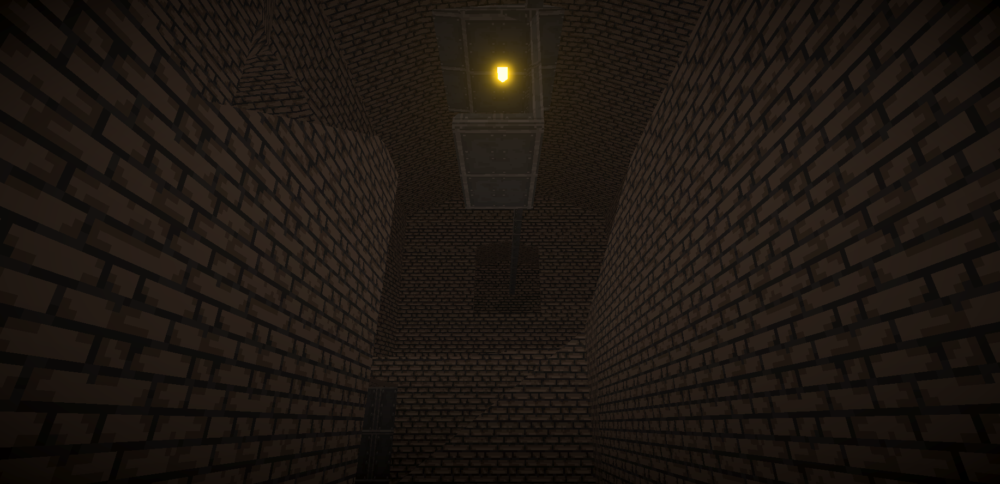
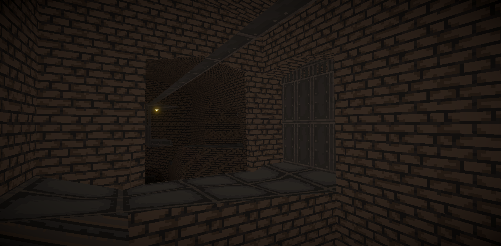
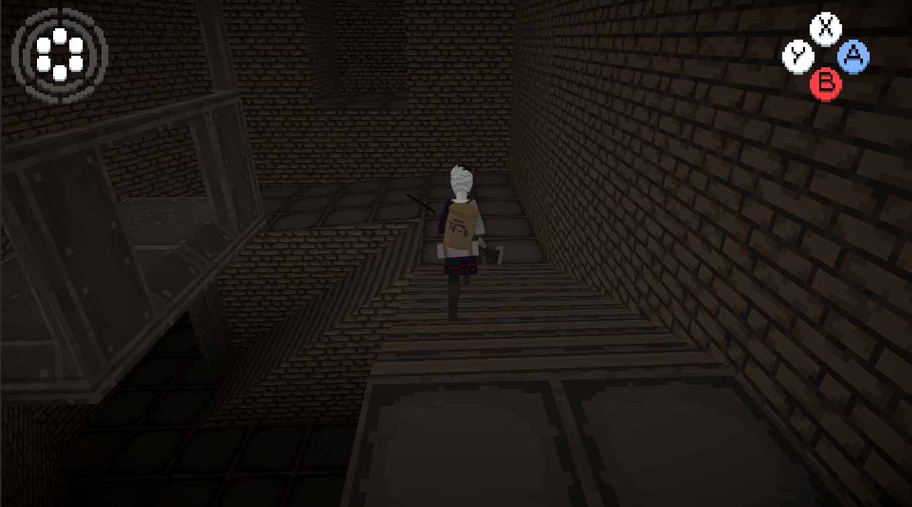
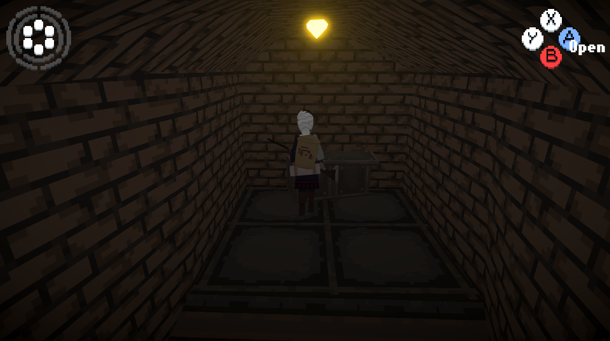

# Atrabile

 
 
 

# Description

## Description

 A retro narrative RPG game prototype inspired by _The Legend Of Zelda_ series and the worldbuilding of _Nausicaä of the Valley of the Wind_.

> Journey through war-torn lands in search of ancient philosophal stones as you battle the curse of the Black Bile! Unravel the mysteries of a fallen civilisation, and ultimately find hope amidst a desolate world.
 
 
 
 
 
